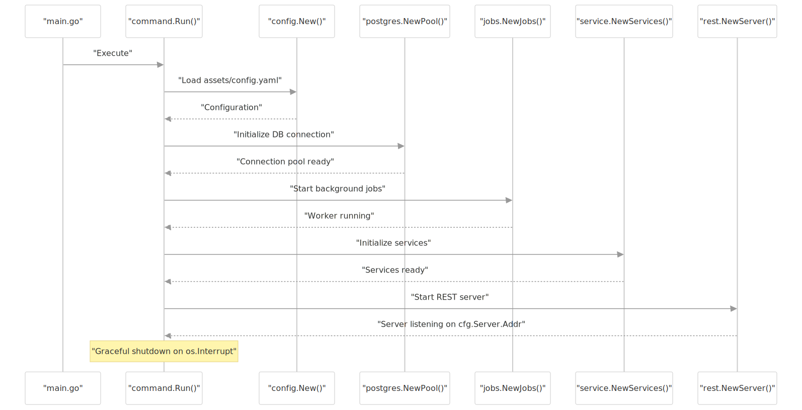

# Spallet

Split Wallet (spallet) Service.

## Running

Run the application with:

```shell
docker compose up -d
```

It will listen on port `4004`. The config file is located [here](./assets/config.yaml) and is
mounted into the container. By default, database volumes are disabled. To make
data persistent, uncomment related section in the `compose.yaml` file.

### Tests

To run all tests:

```shell
make test
```

Unit tests use `mockery` generated implementations to test the services with
mocked dependencies.  
Run `make unit-test` to run them.

Integration tests are ran against an ephemeral container database. A separate
module is used for this purpose. Refer to its [directory](internal/test/integration)
for more details.  
Run `make integration` to run them. Make sure you have docker running.

### Stress Load

In order to test the application under load, a package is written to replicate
the traffic. It simulates roughly **10,000 deposits** and **2,000 withdraw**
requests per hour, per user.

Run `make stress-load` to start it with default parameters of `10` users.

## Open API

OpenAPI (swagger) specification files are located [here](./assets/docs/openapi).
Visit <http://127.0.0.1:4004/swagger/index.html> for the UI.

## Design Overview

### Goals

- Implement a split balance wallet with frozen funds feature.
- Provide a reliable system that supports deposits, withdrawals, balance checks
  and transactions history.
- Ensure atomicity, consistency, and scalability under concurrent usage.
- Prevent double spending and handle failures gracefully.

### Architecture

- **Ledger-based model**: all money movements (deposits, withdrawals) are
    recorded as immutable transactions.
- Two balance views:
  - Available Balance → what the user can currently withdraw.
  - Total Balance → all deposited funds, minus withdrawals.
- States: transactions move through pending → completed or failed. Failures are
   retried, and will eventually be handled via the **refund procedure**.
- Database: **PostgreSQL** is the source of truth, chosen for strong consistency
  and atomicity.



### Technical Decisions

1. **Transaction-first design**
   - All operations are append-only transactions. Balances are derived, not
    stored as single entities. This ensures traceability and prevents
    inconsistencies.

2. **Balance calculation**
   - Optimized with a cached balances table, and is updated incrementally.

3. **Concurrency control**
   - Withdrawals acquire a row-level (FOR UPDATE) lock on the user’s balance.
    This serializes withdrawals per user and guarantees no overspending.

4. **Refund procedure**
   - Withdrawals involve external bank calls; retries with backoff are used.
    `failed` requests are refunded.
   - In case of a service shutdown, all pending processes are refunded on the
    next server startup.



### Workflow

1. **Deposit**
   - Recorded as a new transaction, with optional release date.
   - Adds to total balance, and to available balance immediately or after the
    release date.

2. **Withdrawal**
   - Balance is checked under a row-level lock.
   - Reference ID (uuid) is generated for each processing request.
   - Withdrawal transaction inserted (with `pending` status).
   - External bank integration processes the request (mocked 25% failure rate).
   - On success → marked `completed`.
   - On failure → marked `failed` and a refund deposit will be inserted.

3. **Balance Check**
   - Derived from transactions table (ledger).
   - Optimized through a cached `balances` table for high performance.

4. **Transactions History**
   - Retrieve list of user's transactions. WIth support for curser-based
    pagination.

5. **User Creation**
   - Create (mocked) users, for testing purposes.


